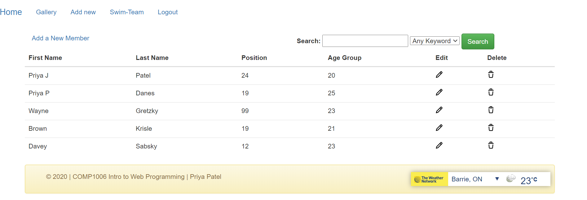

# Swim Website

## Purpose

> A PHP/mySQL website that tracks Swim Memebers' info via CRUD, search/sort, and users via register/login.

This website was developed in my COMP1006 Intro to Web Programming  course at Georgian College.  I was asked to create a website based on my interests, so I chose Swim Team Records.  This website implements CRUD functionalities, register/login pages, securing pages via authentication, search and sort features and APIs.

## Technologies Learned
- PHP
- mySQL
- watercss
- JSON/APIs such as reCAPTCHA v.3, weather widget
- JavaScript

## Launch
- Visit [my project's website](https://lamp.computerstudi.es//~Priya200447419/comp1006/swim/login.php) and feel free to register/login to play around

To launch this, you'll have to clone my Github files to your PHP server, change the credentials listed in db.php, and run my .sql scripts in your mysql database.  

## Demo

Below are a series of videos, in reverse chronological order, where I'm learning about PHP/mySQL.  I attempt to explain what's happening from a coding perspective.

[Quiz 12.1](https://loom.com/insert-your-loom-url-here)
Integrated a weather widget, created my own JSON API, and included reCAPTCHA v.3

[Quiz 11.4](https://loom.com/insert-your-loom-url-here)
Implemented a title search and a sort by table column

[Quiz 10.4](https://www.loom.com/share/3f6caef19f8c4874aa7e14829c94b1b5)
Created an upload photo feature that allows pictures to be associated with each member

[Quiz 9.4](https://www.loom.com/share/656054144d634e569a8f4b7b3d093c01)
Created and configured my 404 page and error page to display if anything wrong were to happen

[Quiz 8.5](https://www.loom.com/share/9c285f7ab9714ea58e8ef3dbd9e7cdc9)
I had to secure my pages based on if the user authenticated

[Quiz 7.5](https://www.loom.com/share/0864e102f6014207a4864553ffeb07e9 )
Created my register page and login page for users to authenticate

[Quiz 6.3](https://www.loom.com/share/6187583a1a5a437a9b0b955eeb432f15)
I've now completed the Edit and Delete functionality

[Quiz 5.5](https://www.loom.com/share/ad6c0919a11748618f990540ddd0bccd)
At this point, my website can display all records, and a user can select an individual record to display its details

[Lab 4.1](https://www.loom.com/share/7932684fda3641509669fb456d0d427e)
What happens when I modify a GET request at a major retail website

[Quiz 3.2](https://www.loom.com/share/e256a1911a2b45e6858d95aaf10949e7)
I demonstrated how to display one record from a list of all records

[Lab 2.2](https://www.loom.com/share/9e1e99435e7b4620a2bb1351e1b84799e)
I demonstrated a basic form submit request and explained what happens under the hood

[Lab 1.1](https://www.loom.com/share/7d8330d692434efea1584a17d42476eb)
Here's where I introduced myself and had to say some of my interests.

